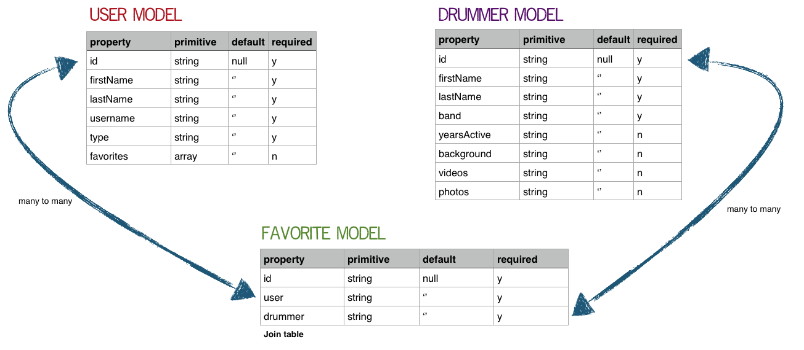

# Drumr app
## The Iron Yard-Austin Final Project - continuing work

### Live Site

Original project [hosted on Get Forge](http://drumr.getforge.io/)

### Description

A song comes on the radio. You recognize that earth-shattering beat pounding on the drums. You say to yourself, "The drummer is fantastic! I wish I could remember the name of the drummer in this band."

You need Drumr. When you have that burning desire to know which drummer is in your headphones, Drumr is your new helper.

When you start Drumr, you enter the band's name to search for the drummer of the group. You are presented with facts about the drummer such as background, bands, recordings, pictures, and videos. This is a great place to learn more about your favorite stick-wielding musician. If you already know the name of a drummer, you can enter it into the search bar and learn more to impress your friends with the depth of your percussive prowess.

Fire up Drumr to get in touch with your primal instincts and learn more about the drummers that drive your favorite bands.

### User Stories

[Trello board](https://trello.com/b/55gmtuWb/drumr-app) for user stories

### Wireframes

[All wireframes](images/drumr-wireframes.pdf) - mobile, tablet, desktop

_Made using Balsamiq Mockup_

### Models

### APIs, Libraries, Plug-ins, and Frameworks

Wikipedia API

Info from drummerworld.com

React.js

### Get in touch to learn more

[Blog](http://www.drumsensei.com)

[@drumsensei](https://twitter.com/drumsensei) on Twitter

[Mike Mathew](https://www.linkedin.com/in/m2mathew) on LinkedIn
